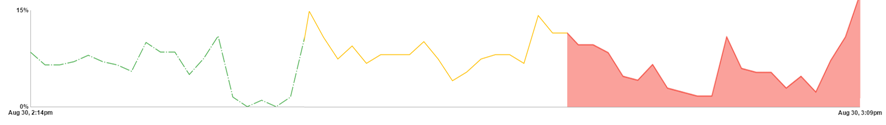

# Front End Overview
An explination of how the front end should look and work.

## Tabs
The Dashboard is fundamentally composed of tabs, each tab having a specific use. By default the Dashboard has six tabs with predefined functionality; however, this can be customized-- new tabs can be created and old removed.

### Summary, Performance, and ECP
The summary, performance, and ECP tabs are composed of charts and sensor displays pertaining to the theme of the tab. Although these can be edited, their functionality is relatively static and mainly stand as an example of what can kind of tabs can be built using the Dashboard.

### All Sensors
The all sensors tab contains a list of all the sensors currently registered by the System Monitor Dashboard. The list provides a resource to determine what exactly is being monitored as well as information about each of the registered sensors.

### Playground
The playground tab is widget based, allowing for creation of custom dashboard layout by building a set of widgets that can contain any of the visualization methods used in any other part of the Dashboard.  Widgets are created, and set up to display sensor information through the browsers UI and require no writing of code. Playground widget configurations can be saved to the browsers local storage as well as exported and imported as a json string.

### Showcase
The showcase tab is a details how to create new tabs, hook into the REST API, and how to use visualization tools when customizing the System Monitoring Dashboard. It focuses on continuing development of the System Monitoring Dashboard and contains live examples, code snippets, and detailed explinations of all the configurations of the System Monitor Dashboard components

## Visualization Tools
There are three default visualization tools: a line chart, a sparkline chart, and a sensor display. They are built using angular element directives and can be customized by changing their html element's attributes. Additionally, all of the default visualization tools are connected to the front-end portion of the REST API and will automatically keep the data they display up-to-date.

### Line Chart
The line chart implements [NVD3's line chart](http://nvd3.org/examples/line.html), it will display a green dashed line when the sensor is in a normal state, a yellow solid line when the sensor is in a warning state, and a red solid line with the area below it filled when the sensor is in an alert state. Additionally, when hovering over a point on the line numerical data will be shown about that point in the form of a tooltip

> Above is three screenshots of the same line chart super imposed on top of each other to show all three styles a line chart takes to show state. From left to right: normal, warning, alert.

### Sparkline Chart
The sparkline chart implements NVD3's line chart as well, but with a more condensed format. Its functionality is identical to the line chart.

### Sensor Display
The sensor display is a numerical display that can show all of a sensors properties and data. The state is depicted by three horizontal bars, the bottom is green in a normal state, the middle is yellow in a warning state, and the top is red if in an alert state. Which of the eleven available metrics to show on a sensor display is user definable, as well as the color and width of each metrics cell on the display.

> Above is four screenshots of a sensor icon shown on a sensor display. From left to right: no data, normal, warning, alert.

### Metadata Popup
The metadata popup is a custom tooltip that shows a sensors properties, such as warning and critical value as well as description. By hovering over a charts title, or a row on the all sensors tab the metadata popup will be displayed.
